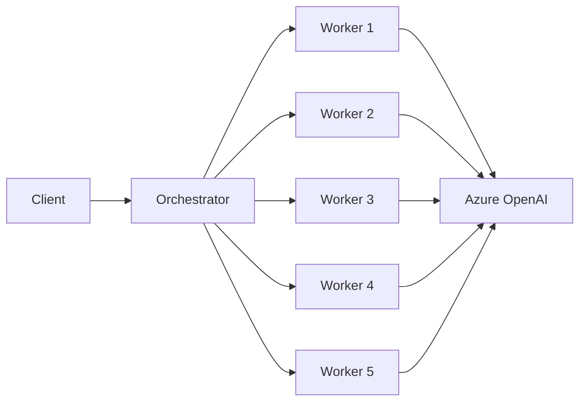

# 🚀 Azure OpenAI Secure Agent Mesh  
*A fully containerized, multi‑agent microservice mesh built with FastAPI, Docker, Azure Container Apps, and Azure OpenAI.*

---

## 📘 Overview

This project implements a **secure fan‑out/fan‑in microservice mesh** where:

- An **orchestrator** receives a request  
- It distributes work across **five worker agents**  
- Each worker independently calls **Azure OpenAI**  
- The orchestrator aggregates results and returns a unified response  

This README provides **complete, end‑to‑end guidance**, including:

- Azure setup  
- Docker + VS Code workflow  
- Container Apps deployment  
- Debugging & troubleshooting  
- Architecture rationale  
- Security model  
- “What I Learned” section  

This is the **authoritative guide** for deploying and operating this system.

---

## 📁 Repository Structure

```
azure-openai-secure-agent-service/
├── orchestrator/
│   ├── main.py
│   ├── Dockerfile
│   └── requirements.txt
│
├── worker/
│   ├── main.py
│   ├── Dockerfile
│   └── requirements.txt
│
└── README.md
```

---

## 🧠 Architecture



### 🔄 Flow Summary
1. Client sends request to orchestrator  
2. Orchestrator fans out to 5 workers  
3. Each worker calls Azure OpenAI  
4. Workers return results  
5. Orchestrator aggregates and responds  

---

## 🧰 Prerequisites

### Local Tools
- Azure CLI  
- Docker Desktop  
- Visual Studio Code  
- Git  
- Python 3.10+ (optional)

### Azure Resources
- Azure OpenAI  
- Azure Container Registry (ACR)  
- Azure Container Apps  
- Log Analytics Workspace  

---

# 1️⃣ Azure CLI Login & Subscription Setup

```powershell
az login
az account show
az account set --subscription "<your-subscription-id>"
```

Install required extensions:

```powershell
az extension add --name containerapp --upgrade
az extension add --name containerregistry --upgrade
az extension add --name monitor --upgrade
az extension add --name cognitiveservices --upgrade
```

---

# 2️⃣ Clone the Repository

```powershell
git clone https://github.com/joshphillis/azure-openai-secure-agent-service.git
cd azure-openai-secure-agent-service
```

---

# 🐳 3️⃣ Start Docker Desktop

Verify Docker is running:

```powershell
docker info
docker context ls
```

---

# 💻 4️⃣ Open in VS Code

1. Open VS Code  
2. File → Open Folder → `azure-openai-secure-agent-service/`  
3. Terminal → New Terminal  
4. Use **PowerShell**  

---

# 5️⃣ Set Required Environment Variables

```powershell
$env:AZURE_OPENAI_ENDPOINT="https://<your-endpoint>.openai.azure.com/"
$env:AZURE_OPENAI_API_KEY="<your-azure-openai-key>"
$env:AZURE_OPENAI_DEPLOYMENT="<your-model-deployment-name>"

$env:WORKER_API_KEY="<shared-worker-api-key>"
$env:ORCHESTRATOR_API_KEY="<orchestrator-api-key>"
```

Verify:

```powershell
gci env:AZURE_OPENAI_ENDPOINT
gci env:WORKER_API_KEY
```

---

# 6️⃣ Local Development (Optional)

### Build Images
```powershell
docker build -t local-orchestrator ./orchestrator
docker build -t local-worker ./worker
```

### Run Worker
```powershell
docker run -p 8001:8000 `
  -e AZURE_OPENAI_ENDPOINT=$env:AZURE_OPENAI_ENDPOINT `
  -e AZURE_OPENAI_API_KEY=$env:AZURE_OPENAI_API_KEY `
  -e AZURE_OPENAI_DEPLOYMENT=$env:AZURE_OPENAI_DEPLOYMENT `
  -e WORKER_API_KEY=$env:WORKER_API_KEY `
  local-worker
```

### Run Orchestrator
```powershell
docker run -p 8000:8000 `
  -e ORCHESTRATOR_API_KEY=$env:ORCHESTRATOR_API_KEY `
  -e WORKER_API_KEY=$env:WORKER_API_KEY `
  -e WORKER_URLS="http://host.docker.internal:8001" `
  local-orchestrator
```

### Test Worker
```powershell
Invoke-WebRequest -Uri "http://localhost:8001/summarize" `
  -Method POST `
  -Headers @{ "x-api-key" = $env:WORKER_API_KEY } `
  -Body '{"text": "hello"}'
```

### Test Orchestrator
Open:

```
http://localhost:8000/docs
```

---

# 7️⃣ Create Azure Resource Group

```powershell
az group create `
  --name agent-mesh-rg `
  --location eastus
```

---

# 8️⃣ Create Azure OpenAI Resource + Deployment

```powershell
az cognitiveservices account create `
  --name openai-joshua-foundry `
  --resource-group agent-mesh-rg `
  --kind OpenAI `
  --sku S0 `
  --location eastus `
  --custom-domain openai-joshua-foundry
```

Then in Azure Portal:

1. Open the resource  
2. Go to **Deployments**  
3. Deploy **GPT‑4o‑mini**  
4. Copy endpoint, API key, deployment name  

---

# 9️⃣ Create Azure Container Registry (ACR)

```powershell
az acr create `
  --resource-group agent-mesh-rg `
  --name agentmeshacr `
  --sku Basic `
  --location eastus
```

Login:

```powershell
az acr login --name agentmeshacr
docker login agentmeshacr.azurecr.io
```

---

# 🔟 Build & Push Images to ACR

### Orchestrator
```powershell
cd orchestrator
docker build -t agentmeshacr.azurecr.io/summaries-orchestrator:latest .
docker push agentmeshacr.azurecr.io/summaries-orchestrator:latest
cd ..
```

### Worker
```powershell
cd worker
docker build -t agentmeshacr.azurecr.io/summaries-worker:latest .
docker push agentmeshacr.azurecr.io/summaries-worker:latest
cd ..
```

---

# 1️⃣1️⃣ Create Log Analytics + Container Apps Environment

```powershell
$LOG_WS_NAME="workspace-agentmeshrgVgQ8"

az monitor log-analytics workspace create `
  --resource-group agent-mesh-rg `
  --workspace-name $LOG_WS_NAME `
  --location eastus

$LOG_WS_ID=$(az monitor log-analytics workspace show `
  --resource-group agent-mesh-rg `
  --workspace-name $LOG_WS_NAME `
  --query id -o tsv)

az containerapp env create `
  --name agent-mesh-env `
  --resource-group agent-mesh-rg `
  --location eastus `
  --logs-workspace-id $LOG_WS_ID
```

---

# 1️⃣2️⃣ Deploy Worker Container Apps

### Deploy 5 Workers
```powershell
foreach ($i in @("", "-2", "-3", "-4", "-5")) {
  az containerapp create `
    --name "summaries-worker$i" `
    --resource-group agent-mesh-rg `
    --environment agent-mesh-env `
    --image agentmeshacr.azurecr.io/summaries-worker:latest `
    --target-port 8000 `
    --ingress external `
    --env-vars `
      AZURE_OPENAI_ENDPOINT=$env:AZURE_OPENAI_ENDPOINT `
      AZURE_OPENAI_API_KEY=$env:AZURE_OPENAI_API_KEY `
      AZURE_OPENAI_DEPLOYMENT=$env:AZURE_OPENAI_DEPLOYMENT `
      WORKER_API_KEY=$env:WORKER_API_KEY
}
```

### Set minReplicas = 1
```powershell
foreach ($i in @("", "-2", "-3", "-4", "-5")) {
  az containerapp update `
    --name "summaries-worker$i" `
    --resource-group agent-mesh-rg `
    --min-replicas 1
}
```

### Collect Worker URLs
```powershell
foreach ($i in @("", "-2", "-3", "-4", "-5")) {
  az containerapp show `
    --name "summaries-worker$i" `
    --resource-group agent-mesh-rg `
    --query properties.configuration.ingress.fqdn -o tsv
}
```

---

# 1️⃣3️⃣ Deploy the Orchestrator

Set worker URLs:

```powershell
$env:WORKER_URLS="https://summaries-worker.<fqdn>,https://summaries-worker-2.<fqdn>,https://summaries-worker-3.<fqdn>,https://summaries-worker-4.<fqdn>,https://summaries-worker-5.<fqdn>"
```

Deploy:

```powershell
az containerapp create `
  --name summaries-orchestrator `
  --resource-group agent-mesh-rg `
  --environment agent-mesh-env `
  --image agentmeshacr.azurecr.io/summaries-orchestrator:latest `
  --target-port 8000 `
  --ingress external `
  --env-vars `
    ORCHESTRATOR_API_KEY=$env:ORCHESTRATOR_API_KEY `
    WORKER_API_KEY=$env:WORKER_API_KEY `
    WORKER_URLS=$env:WORKER_URLS
```

---

# 1️⃣4️⃣ Test the Mesh

### Swagger UI
```
https://summaries-orchestrator.<fqdn>/docs
```

### PowerShell
```powershell
Invoke-WebRequest -Uri "https://summaries-orchestrator.<fqdn>/summarize" `
  -Method POST `
  -Headers @{ 
      "x-api-key" = $env:ORCHESTRATOR_API_KEY
      "Content-Type" = "application/json"
  } `
  -Body '{"text": "This is a sample document that will be summarized by multiple workers."}'
```

---

# 🛠️ Debugging & Troubleshooting

### View Logs
```powershell
az containerapp logs show `
  --name summaries-worker `
  --resource-group agent-mesh-rg `
  --follow
```

### Exec Into Container
```powershell
az containerapp exec `
  --name summaries-worker `
  --resource-group agent-mesh-rg `
  --command "printenv"
```

### Common Issues

#### ❌ ACR push fails  
Fix:
```powershell
az acr login --name agentmeshacr
docker login agentmeshacr.azurecr.io
```

#### ❌ Worker returns 401  
Cause: wrong API key  

#### ❌ Orchestrator cannot reach workers  
Fix: workers must have **external ingress**

#### ❌ Cold starts  
Fix: set `--min-replicas 1`

#### ❌ Timeout issues  
Orchestrator uses:
```python
httpx.AsyncClient(timeout=60.0)
```

---

# 🧭 Operational Guidance

### Redeploy Updated Images
```powershell
docker build -t agentmeshacr.azurecr.io/summaries-orchestrator:latest .
docker push agentmeshacr.azurecr.io/summaries-orchestrator:latest

az containerapp update `
  --name summaries-orchestrator `
  --resource-group agent-mesh-rg `
  --image agentmeshacr.azurecr.io/summaries-orchestrator:latest
```

### Restart a Worker
```powershell
az containerapp restart `
  --name summaries-worker `
  --resource-group agent-mesh-rg
```

### Scale Workers
```powershell
az containerapp update `
  --name summaries-worker `
  --resource-group agent-mesh-rg `
  --min-replicas 3
```

---

# 🧩 Architecture Rationale

### Why FastAPI?
- Lightweight  
- Async‑friendly  
- Ideal for microservices  

### Why httpx.AsyncClient?
- True async  
- Parallel fan‑out  
- Timeout control  

### Why 5 Workers?
- Demonstrates horizontal scaling  
- Predictable fan‑out pattern  

### Why Azure Container Apps?
- Serverless containers  
- Autoscaling  
- Simpler than AKS  

### Why ACR?
- Private  
- Secure  
- Azure‑native  

---

# 🔐 Security Model

### Worker API Key
- Protects workers from public misuse  
- Only orchestrator should call workers  

### Orchestrator API Key
- Protects orchestrator from public misuse  

### Azure OpenAI Key
- Never exposed to clients  
- Only workers use it  

### Zero‑Trust Boundaries
- Workers do not trust clients  
- Orchestrator does not trust the internet  

---

# 🧹 Cleanup

```powershell
az group delete `
  --name agent-mesh-rg `
  --yes `
  --no-wait
```

# 🧠 What I Learned

- How to build a distributed microservice mesh  
- How to deploy containerized workloads to Azure  
- How to debug Azure Container Apps  
- How to authenticate Docker to ACR  
- How to design secure API key boundaries  
- How to implement fan‑out/fan‑in patterns  
- How to build reproducible cloud workflows  
- How to troubleshoot real‑world cloud issues  
- How to validate connectivity between distributed services  
- How to operate a production‑ready microservice mesh  
